# SUPPLY-CHAIN.md — how an Odin editor gets built inside a Flatpak sandbox

Four repositories exist to compile one editor. This is why, and what would
collapse them back down.

## The constraint

A Flatpak build sandbox reaches nothing on the host. Not the machine's compiler,
not the CI runner's, not the network. `setup-amber-odin` and the `amber-odin`
deb both install an Odin compiler — and both are invisible from inside a build.

So an Odin application has no compiler unless one is built inside the sandbox.
That single fact produces everything below.

It has a second half that is easy to miss: the toolchain is needed at **runtime**
too. OLS has no type checker of its own and produces diagnostics by shelling out
to `odin check`, so a runnable compiler plus `core`, `base` and `vendor` has to
survive into `/app/opt/odin`. A build-time-only answer is not enough.

## 1. The compiler patch — `Hyperquader-Coders/Odin`, branch `llvm-target-guards`

Upstream Odin names each target's `LLVMInitialize*` symbols directly, and
`src/llvm-c/Config/Targets.def` is vendored — it lists every LLVM target
regardless of the LLVM being linked. The freedesktop `llvm22` extension provides
X86, AMDGPU, ARM, NVPTX and WebAssembly, but neither AArch64 nor RISCV. The
symbols are declared, the link fails over branches an x86_64 build can never
take, and Odin cannot be built against that SDK at all.

Deleting the offending lines with `sed` before building is the crude way out, and
it silently removes a target the compiler would otherwise support. The patch is
the honest one: `build_odin.sh` reads `llvm-config --targets-built` and
defines `ODIN_LLVM_HAS_<TARGET>`; `llvm_backend.cpp` compiles each `switch` arm
only when its target is present. Asking for an absent target names it and exits 1
instead of failing the build.

Verified against a full LLVM (unchanged behaviour), a simulated partial LLVM, and
the real `llvm20` and `llvm22` SDK extensions.

## 2. The SDK extension — `odin-sdk-extension`

No Odin SDK extension existed on Flathub. D has two, Ada has three, FreePascal
has one — Odin had none, so every Odin application shipping as a Flatpak had to
build a compiler inside its own manifest, as yggr did.

The extension does it once: builds the compiler from the fork against `llvm22`,
and installs to `/usr/lib/sdk/odin` with `core`/`base`/`vendor`, the libLLVM it
was linked against, and an `enable.sh`.

**It does not remove the need for `llvm22` in a consumer.** Odin links through
clang — `src/linker.cpp` calls it by name so it can query the compiler driver's
specs for `libgcc_s`, `ld-linux` and `unwind` — and the freedesktop SDK ships
`gcc` but no `clang`. A consumer declaring only the Odin extension compiles and
then dies at the link step.

## 3. The archive — `amberlinux-flatpak`, at `flatpak.amberlinux.org`

An extension is only useful if `sdk-extensions` can resolve it, which means a
flatpak remote. The archive is an ostree repo in `archive-z2` mode, GPG-signed
with the same key as the apt archive, with the summary and refs served as
Cloudflare static assets and `objects/**` plus `deltas/**` from R2 — split at the
25 MiB asset cap.

The trap worth carrying forward: **ostree objects are content-addressed except
two kinds.** `.commitmeta` is named after the commit it annotates and changes
when a signature is added; `deltas/**` is named after a commit pair and changes
when regenerated. Treating those as immutable — skipping re-upload, or serving
them with a year-long cache — produces "GPG verification enabled, but no
signatures found" and "Invalid checksum for static delta", neither of which
points anywhere near a caching header.

## 4. The consumer — yggr

yggr declares both extensions, copies `/usr/lib/sdk/odin` into `/app/opt/odin`
(the extension is build-time only; OLS needs the compiler at runtime), and builds
OLS and then itself with that compiler.

What it no longer does: clone the fork, run `build_odin.sh`, or copy libLLVM out
of the SDK with two carefully-worded globs. That module went from about thirty
lines to three, and one pin — the compiler — moved into the extension.

OLS is still built from source here rather than taken as a prebuilt release,
because the pairing is version-sensitive: ols `dev-2026-05` uses
`Odin_OS_Type.Haiku`, which the compiler dropped before `dev-2026-07a`. A
prebuilt binary hides that skew; building from source turns it into a compile
error.

## What retires all of this

The chain is longer than it should be, and two things shorten it.

**Upstream the LLVM-target patch.** Then the fork disappears and the extension
builds from `odin-lang/Odin` at a release tag. The argument writes itself — it
lets Odin build against any LLVM configuration, which is what every distribution
and SDK packager needs. It is blocked on `build.bat`, which defines none of the
new macros, so the patch is Unix-only and cannot go up half-done.

**Flathub submission.** Then the extension is on Flathub, every Odin application
can reach it, and this archive stops being load-bearing for anyone outside the
suite. It is blocked on the fork above, on moving from `--filesystem=host` to
portals, and on marksman — the last prebuilt blob, which Flathub review treats as
a submission blocker.

Both are tracked in [`../MoSCoW.md`](../MoSCoW.md). Neither is urgent, and both
are the difference between a private workaround and a contribution.
